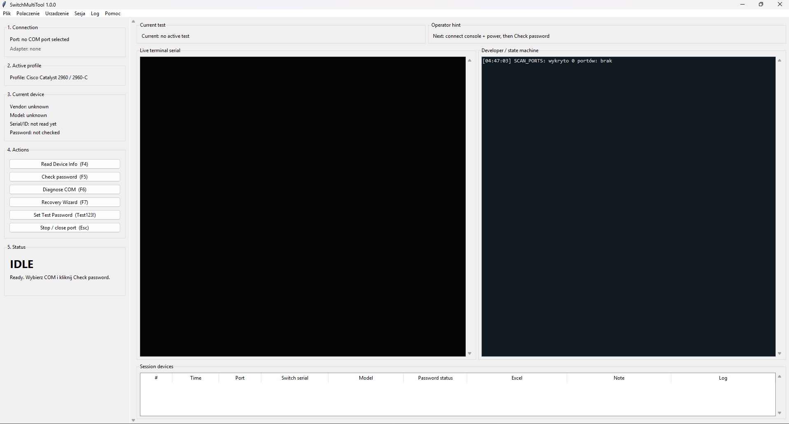

# SwitchMultiTool v1.0.0



A desktop tool for servicing network switches over a serial console. This
version is deliberately limited to **a single device at a time** and does not
yet implement TIR/batch mode.

## About the project

SwitchMultiTool is a **Proof of Concept** — a desktop application (Python + Tkinter)
for working with Cisco IOS switches (2960/2960X series) during testing, repair,
and shipment preparation. It connects to the device over a serial port (USB-serial,
including CH340 adapters) and automates typical service tasks:

- verifying and recovering passwords (`enable`/console),
- reading model, serial number, and IOS version,
- a guided Password Recovery procedure,
- logging a work session with a final report (CSV + XLSX),
- automatically checking off tested devices in a customer's order spreadsheet.

**Status: PoC.** The application currently supports only a single connected
device at a time — this is a deliberate scope limit for this stage, not a missing
feature. Everything planned for this scope works in practice. Batch mode
(multiple switches at once, TIR/batch) is a future development stage and is
not covered by this PoC.

## Features

- Check password / F5 with `--More--` pager handling.
- Read Device Info / F4 using commands from the profile.
- Recovery Wizard / F7.
- Set Test Password.
- Order Excel with backup and checking off the found serial number.
- Session mode:
  - `Start session`,
  - `End session / report`,
  - a session only starts after clicking `Start session`; F5 alone does not start one,
  - a device table within the session,
  - session CSV saved to `sessions/YYYYMMDD_HHMMSS/session_results.csv`,
  - XLSX report saved to `reports/YYYYMMDD_HHMMSS/session_report.xlsx`.
- Known Devices DB in `data/known_devices.sqlite3`.
- Manual override: `UNLOCKED`, `LOCKED`, `SKIP`, `DAMAGED`, `NO_CONSOLE`, `UNKNOWN`.
- Log viewer with filtering and `Copy summary`.
- Auto profile detection for Cisco 2960/2960X/generic IOS.
- Command profiles in `config/switchmultitool.ini`.
- Automatic flow-control suggestion based on VID:PID (CH340 `1A86:7523` -> `raw-win-only`).

Session IDs are a date and time, e.g. `20260611_231500`.

## Layout

The single-device workflow is organized into:

- Connection / COM,
- Device profile,
- Current device,
- Actions,
- Live terminal serial,
- Developer / state machine,
- Recent checks in current session.

## Running on Windows

Unzip, go into the folder, and run:

```bat
start_windows.bat
```

The starter uses `python`, not `py`.

Manually:

```powershell
python -m venv .venv
.\.venv\Scripts\python.exe -m pip install -r requirements.txt
.\.venv\Scripts\python.exe run_app.py
```

## Testing on your CH340

1. Select COM4.
2. The app should detect `VID:PID=0x1A86:0x7523` and set `raw-win-only`.
3. Click **Check password**.
4. Watch the **Live terminal serial** and **Developer / state machine** panels.
5. The result is saved to `results/check_results.csv`, and the full session log to `logs/`.

## Shortcuts

- `F2` — Refresh COM
- `F5` — Check password
- `F6` — Diagnose COM
- `Esc` — Stop / close port

## Order Excel / checking off an order

In the `6. Order Excel` panel you can point to an `.xlsx` or `.xlsm` file containing
the customer's equipment list. After a `Check password (F5)` test, if the result is
`UNLOCKED`, the app:

- searches for the switch's serial number across all sheets,
- highlights the entire matching row in green,
- adds a comment to the serial number cell: `Data testu: YYYY-MM-DD HH:MM:SS | Status: UNLOCKED`.

A sample file for testing is at `samples/order_inventory_example.xlsx`.
Before saving, the Excel file should be closed in Microsoft Excel, since an open
worksheet can block the write.

Before the first modification of a file in a given session, the app makes one backup
of the original: `backups/order_excel/YYYY-MM-DD/nazwa_pliku__session_YYYYMMDD_HHMMSS.xlsx`.
Subsequent checks in the same session reuse the same backup, so the directory
doesn't grow pointlessly.

## Application config

Main settings live in `config/switchmultitool.ini`, no need to touch the code:

- serial port: default baud rate, list of flow profiles, log directory,
- results and backups: results CSV and Excel backup directory,
- F5 detector: boot timeout, idle, enable and config mode,
- Recovery Wizard: timeouts and the list of files to delete from flash,
- test password for `Set Test Password`,
- known USB-serial adapters by `VID:PID`,
- MODE instructions per switch model.

Files deleted by the Recovery Wizard are in the `[recovery]` section, `delete_files` field.
Format: `filename|required` or `filename|optional`.

## Roadmap

- Read Device Info: `show version`, `show inventory`, model/serial/hostname parsing.
- Set Test Password: setting up a test `enable secret` and optionally console/vty.
- Password Recovery Wizard: a guided password reset procedure for Cisco IOS / 2960-C.
- Batch/TIR mode: handling multiple switches in one session.
